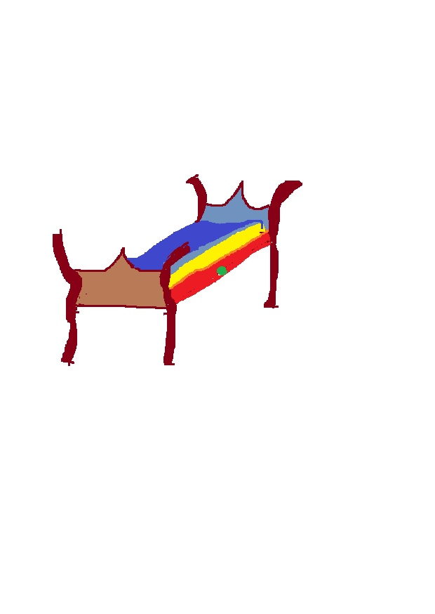

# Princezna na hrášku
------

Bylo jednou jedno království a v tom království žil princ. Byl to princ udatný, chrabrý, chytrý, hodný a ani špetka krásy mu nechyběla. Jeho otec, starý král, byl ale již velmi stár, a tak princ dostal úkol. Najít si princeznu, kterou by si vzal za nevěstu, a tak mohl kralovat celému království místo svého otce, který by si již jistě rád odpočinul. Takové bylo v jejich království pravidlo, že král musí mít po boku královnu, aby mohli společně kralovat.

A tak se princ vydal do světa, ale než odjel, paní královna mu kladla na srdce, ať si přivede opravdovou princeznu. Princ osedlal koně a vyjel nazdařbůh. Dlouho se trmácel přes hory, lesy, louky a pole. Navštívil cizí království, potkal soustu princezen, ale žádná z nich nebyla ta opravdová princezna. A tak se po dlouhém trmácení vrátil domů s nepořízenou. Královo zdraví se nelepšilo, ba naopak. Paní královna očekávala prince celá nedočkavá, měla o svého jednorozeného syna strach.

Princ se rozhodl, že si doma odpočine na pouhé 3 dny a znovu vyrazí do světa. Ten večer byla venku obrovská bouře a královští rodiče byli velmi rádi, že se jejich syn může ohřát u královského krbu a nemusí se trmácet krajinou. Byla to bouře, jakou celé království předtím ani potom dlouho nezažilo.

V tom náhle někdo klepe u vrat hradu. V takové bouři, kdo to může být? Za dveřmi stála malá osůbka shoulená v plášti, celá mokrá. Komoří uvedli osůbku do zámecké síně. Byla to princezna z nedalekého království. Vydala se na louku, když ji najednou zastihla veliká bouře a ona se nemohla vrátit, protože přes samý déšť a blesky nebylo možné rozpoznat cestu.

I tak dali princezně čistě a suché šaty a povídali si s princeznou a takové veselí a milé povídání v zámeckém sále už dlouho nebylo. Když nastal pozdní večer uložili princeznu do komnaty, aby si mohla do rána odpočinout. Královna sama dohlížela na úpravu princeznina lůžka. Nechala nachystat nejemnější madrace a nechala sloužící, ať jich přinesou co nejvíce. A královna sama nakonec provedla poslední úravu, aby se princezna mohla dobře vyspat.

Dalšího dne se celé království probudilo do slunečného rána, po včerejší ohromné bouřce ani památka. Jen princezna vyšla z komnaty celá rozlámaná. I královští rodiče se ji ptali, copak princezno, nespalo se ti u nás dobře. Princezna jim na to odpověděla, že ani oka nezamhouřila, že ji celou dobu v posteli něco tlačilo. Na to královna vesele zatleskala. Toto je pravá princezna, zvolala. Sama jsem ji pod nejspodnější matraci uložila jedno zrnko hrášku. Jen pravá princezna by mohla cítit tak maličké zrníčko. Princ, který byl v sále také se usmál. 

Netrvalo dlouho a království chystalo svatbu. Princezna prince milovala. On ji také. Od první chvíle, kdy ji spatřil. A jestli nezemřeli žijí a kralují spolu šťastně a v lásce až dodnes.